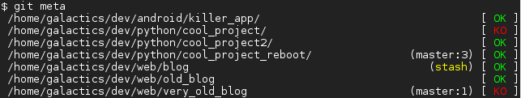

git-meta
========

.. image:: https://travis-ci.org/galactics/git-meta.svg?branch=master
    :alt: Travis tests
    :target: https://travis-ci.org/galactics/git-meta

Git meta is a small program enabling the power of system-wide status check of
all you git repositories.

It uses `pygit2 <https://github.com/libgit2/pygit2>`__, which is Python bindings of
`libgit2 <https://github.com/libgit2/libgit2>`__, a standalone git library writen
in C.

Installation
------------

.. code-block:: shell

    $ pip install git-meta

Alternatively, if you want to install `git-meta` from the sources:

.. code-block:: shell

    $ python setup.py install

You can also install it in a `virtualenv <https://docs.python.org/3/library/venv.html>`__
in order to test and not mess your system configuration.

Documentation
-------------

The documentation uses `Sphinx <http://sphinx-doc.org/>`__. To generate statics HTML
files, go to the `docs` folder and type

.. code-block:: shell

    $ make html

Unit testing
------------

In order to launch the tests sequence of the package, you need
`Pytest <http://pytest.org/latest/>`__ and
`Pytest-cov <https://pypi.python.org/pypi/pytest-cov/>`__ installed.

Just type

.. code-block:: shell

    $ py.test

at the root of the repository.

Old version of git-meta
-----------------------

The old version of git meta can be found `here <https://github.com/galactics/git-meta-old>`__.
